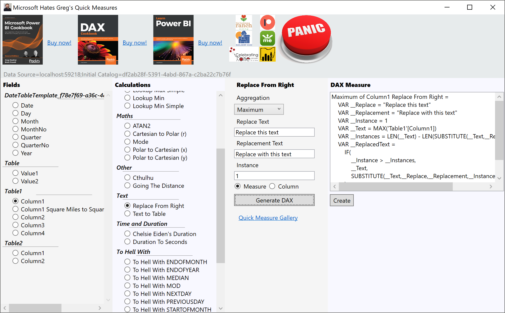

# MicrosoftHatesGregsQuickMeasures
An external tool for creating quick measures in Power BI Desktop or tabular model

## Installation
1. Download the <strong>MicrsoftHatesGregsQuickMeasures.zip</strong> file
2. Extract the files in the .zip to some location, such as <strong>C:\Program Files (x86)\MicrosoftHatesGregsQuickMeasures</strong>
3. Go to where you extracted the files
4. Copy <strong>MicrosoftHatesGregsQuickMeasures.pbitool.json</strong>
5. Paste <strong>MicrosoftHatesGregsQuickMeasures.pbitool.json</strong> to your Power BI Desktop "External Tools" directory (<strong>C:\Program Files (x86)\Common Files\Microsoft Shared\Power BI Desktop\External Tools</strong>)
6. Open <strong>MicrosoftHatesGregsQuickMeasures.pbitool.json</strong> in Notepad and edit the <strong>Path</strong> element to point to the executable file. Please note that you need to use double backslashes \\ for each backslash in the file path, so for example <strong>C:\\\\Program Files\\\\MSHGQM\\\\MicrosoftHatesGregsQuickmeasures.exe</strong>
7. Launch Power BI and go to the "<strong>External Tools</strong>" tab
8. Click "<strong>Microsoft Hates Greg</strong>" icon

## How to Use
1. Choose a column in the <strong>Fields</strong> pane
2. Choose a quick measure in the <strong>Calculations</strong> pane
3. In the quick measure's configuration pane, configure the measure
4. Click "<strong>Generate DAX</strong>"
5. In the "<strong>Dax Measure</strong>" pane, click "<strong>Create</strong>" to create the measure or column in the chosen table (<strong>Fields</strong> pane) in your model

## Notes
- There are not a lot of guard rails
- There is no data type checking for example so if you try to sum a text column, that's on you. 
- Same thing if you use a column from some table you shouldn't
- Won't cause issues with measure and column creation, you just might get some DAX errors
- No, it is not open source
- Original code based on Kay Unkroth's Metadata Translator
- None of the linked charities are associated with myself, they are all just local causes I believe in and my friends sit on their boards
