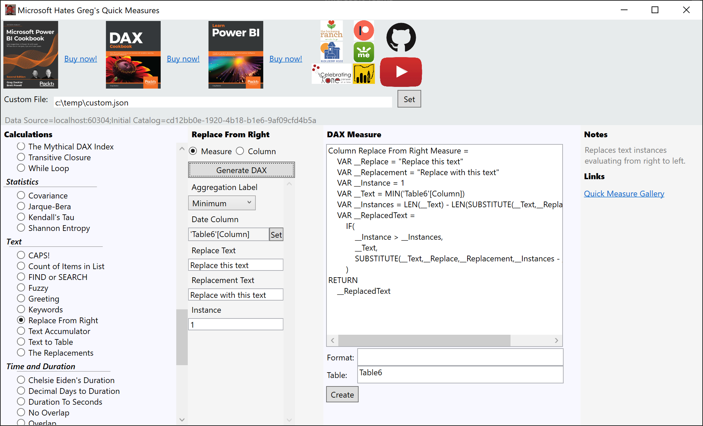

# Microsoft Hates Gregs Quick Measures
An external tool for creating quick measures or columns in Power BI Desktop or tabular model. Read more about it here <a href="https://www.linkedin.com/pulse/microsoft-hates-gregs-quick-measures-greg-deckler-microsoft-mvp-/">Microsoft Hates Greg's Quick Measures</a>

## Installation
1. Download the <strong>MSHGQM_Gamma.zip</strong> file
2. Extract the files in the .zip to some location, such as <strong>C:\Program Files (x86)\MicrosoftHatesGregsQuickMeasures</strong> I right-click the zip file and use Open with and then Windows Explorer and then you can simply copy the top directory and paste it to a new location.
3. Go to where you extracted the files
4. Copy <strong>MicrosoftHatesGregsQuickMeasures.pbitool.json</strong>
5. Paste <strong>MicrosoftHatesGregsQuickMeasures.pbitool.json</strong> to your Power BI Desktop "External Tools" directory (<strong>C:\Program Files (x86)\Common Files\Microsoft Shared\Power BI Desktop\External Tools</strong>)
6. Open <strong>MicrosoftHatesGregsQuickMeasures.pbitool.json</strong> in Notepad and edit the <strong>Path</strong> element to point to the executable file. Please note that you need to use double backslashes \\ for each backslash in the file path, so for example <strong>C:\\\\Program Files\\\\MSHGQM\\\\MicrosoftHatesGregsQuickmeasures.exe</strong>
7. Launch Power BI and go to the "<strong>External Tools</strong>" tab
8. Click "<strong>Microsoft Hates Greg</strong>" icon

## How to Use
1. Choose a quick measure in the <strong>Calculations</strong> pane
2. In the quick measure's configuration pane, configure the measure
3. Click "<strong>Generate DAX</strong>"
4. In the "<strong>Dax Measure</strong>" pane, click "<strong>Create</strong>" to create the measure or column in the chosen Table

## Start Creating Your Own Quick Measures
1. Create a JSON file with the appropriate fields. More information coming otherwise find the <strong>suppotedmeasures.json</strong> file for the format
2. Launch MSHGQM and set the <strong>Custom File</strong> property
3. Click the <strong>Set</strong> button
4. Close and relaunch MSHGQM to load any custom measures

## Updates for Quick Measures
Now that quick measures can be released without recompiling, I will be releasing the supportedmeasures.json file separately. To update the quick measures in your tool simply do the following:
1. Download the latest supportedmeasures.json file
2. Close MSHGQM
3. Locate the supportedmeasures.json file in the <strong>Resources</strong> directory where you installed MSHGQM
4. Replace the file with the new version and then re-open MSHGQM

## Notes
- There are not a lot of guard rails
- There is no data type checking for example so if you try to sum a text column, that's on you. 
- Same thing if you use a column from some table you shouldn't
- Won't cause issues with measure and column creation, you just might get some DAX errors
- No, it is not open source
- Original code based on Kay Unkroth's Metadata Translator
- None of the linked charities are associated with myself, they are all just local causes I believe in and my friends sit on their boards

# MSHGQM Gamma Custom Measure Guide
This file contains information for the creation of custom measures in MSHGQM Gamma. You can create your own JSON file in the following general format:<br/>

```
[
  {
    <custom measure definition>
  },
  {
    <custom measure definition>
  }
]
```
What goes inside the <strong>\<custom measure definition\></strong> are attribute/value pairs. A few are required, the rest are optional. Note that <strong>Configuration</strong>, <strong>MeasureId</strong> and <strong>MeasureGroup</strong> are all required and should all have the same value. Standard JSON format applies. Don't forget to escape double quotes and other characters inside Value's and mind your end of line commas. All variables have two underscores in front of and after the variable text.
```
"Attribute": "Value",
...
"Last Attribute": "Value"
```

|<strong>Attribute</strong>|<strong>Required</strong>|<strong>Value</strong>|<strong>Variables</strong>|
|------------------------------|---------|---------------------------------------------------------------|---------------------------------------------------|
|Configuration|Yes|Defines the group for the measure in Calculations pane|None|
MeasureId|Yes|Defines the group for the measure in Calculations pane|None|
MeasureGroup|Yes|Defines the group for the measure in Calculations pane|None|
DisplayName|Yes|Name displayed in Calculations pane|None|
DAXCode|Yes|Code that appears in Source pane|None|
Format|No|Custom format string to use when creating measure|None|
Notes|No|Notes that appear in Notes pane|None|
HyperLink1|No|URL for first hyperlink in Notes pane|None|
HyperLink1Text|No|Text displayed for first hyperlink in Notes pane|None|
HyperLink2|No|URL for second hyperlink in Notes pane|None|
HyperLink2Text|No|Text displayed for second hyperlink in Notes pane|None|
HyperLink3|No|URL for third hyperlink in Notes pane|None|
HyperLink3Text|No|Text displayed for third hyperlink in Notes pane|None|
HyperLink4|No|URL for fourth hyperlink in Notes pane|None|
HyperLink4Text|No|Text displayed for fourth hyperlink in Notes pane|None|
HyperLink5|No|URL for fifth hyperlink in Notes pane|None|
HyperLink5Text|No|Text displayed for fifth hyperlink in Notes pane|None|
AggregationLabel|No|Label for first corresponding aggregation dropdown. There are 11 of these AggregationLabel, Aggregation1Label - Aggregation10Label|None|
Aggregation|No|Displays aggregation dropdown box. Any value will make the dropdown box appear as well as the correponding label which is the default label unless the corresponding label attribute is configured (AggregationLabel) There are 11 of these, Aggregation, Aggregation1 - Aggregation10. \_\_AGGREGATION\_\_ is replaced with the corresponding DAX aggregation function (SUM, AVERAGE, MAX, MIN, etc.) while \_\_XAGGREGATION\_\_ is replaced with the corresponding DAX "X" aggregator (SUMX, AVERAGEX, MAXX, MINX, etc.)|\_\_AGGREGATION\_\_,<br/>\_\_XAGGREGATION\_\_<br/>(\_\_AGGREGATION1__-\_\_AGGREGATION10\_\_ ),<br/>(\_\_XAGGREGATION1\_\_-\_\_XAGGREGATION10\_\_)|
AggregationType|No|If not present or configured to anything other than "MinMax" then the corresponding dropdown box will display all possible aggregations, otherwise if set to MinMax displays only Minimum and Maximum with default of Minimum|None|
ColumnLabel|No|Sets the label for the corresponding column chooser. There are 11 of these ColumnLabel, Column1Label - Column10Label|None|
Column|No|Displays the column chooser. Value appears as default in textbox. There are 11 of these, Column, Column1 - Column10. Three variables are available for each. \_\_COLUMN\_\_ is replaced by the full 'Table'[Column] text. \_\_TABLENAME\_\_ is only the table name Table (no single quotes) and \_\_COLUMNNAME\_\_ is only the column name Column (no square brackets)|\_\_COLUMN\_\_<br/>\_\_TABLENAME\_\_<br/>\_\_COLUMNNAME\_\_<br/>(\_\_COLUMN1\_\_-\_\_COLUMN10\_\_ ),<br/>(\_\_TABLE1NAME\_\_-\_\_TABLE10NAME\_\_),<br/>(\_\_COLUMN1NAME\_\_-\_\_COLUMN10NAME\_\_)|
ParameterLabel|No|Sets the label for the corresponding parameter texbox. There are 11 of these, ParameterLabel, Parameter1Label - Parameter10Label|None|
Parameter|No|Displays an editable textbox. The value specified is the default text in the texbox. There are 11 of these, Parameter, Parameter1 - Parameter10|\_\_PARAM\_\_<br/>(\_\_PARAM1\_\_ - \_\_PARAM10\_\_)|
AreaFromLabel|No|Sets the label for the AreaFrom dropdown box|None|
AreaFrom|No|Displays dropdown with Area units|\_\_AREAFROM\_\_<br/>\_\_AREACONVERSIONFACTOR\_\_|
AreaToLabel|No|Sets the label for the AreaTo dropdown box|None|
AreaTo|No|Displays dropdown with Area units|\_\_AREATO\_\_<br/>\_\_AREACONVERSIONFACTOR\_\_|
DensityFromLabel|No|Sets the label for the DensityFrom dropdown box|None|
DensityFrom|No|Displays dropdown with Density unitsv\_\_DENSITYFROM\_\_<br/>\_\_DENSITYCONVERSIONFACTOR\_\_|
DensityToLabel|No|Sets the label for the DensityTo dropdown box|None|
DensityTo|No|Displays dropdown with Density units|\_\_DENSITYTO\_\_<br/>\_\_DENSITYCONVERSIONFACTOR\_\_|
DistanceFromLabel|No|Sets the label for the DistanceFrom dropdown box|None|
DistanceFrom|No|Displays dropdown with Distance units|\_\_DISTANCEFROM\_\_<br/>\_\_DISTANCECONVERSIONFACTOR\_\_|
DistanceToLabel|No|Sets the label for the DistanceTo dropdown box|None|
DistanceTo|No|Displays dropdown with Distance units|\_\_DISTANCETO\_\_<br/>\_\_DISTANCECONVERSIONFACTOR\_\_|
MassFromLabel|No|Sets the label for the MassFrom dropdown box|None|
MassFrom|No|Displays dropdown with Mass units|\_\_MASSFROM\_\_<br/>\_\_MASSCONVERSIONFACTOR\_\_|
MassToLabel|No|Sets the label for the MassTo dropdown box|None|
MassTo|No|Displays dropdown with Mass units|\_\_MASSTO\_\_<br/>\_\_MASSCONVERSIONFACTOR\_\_|
TempFromLabel|No|Sets the label for the TempFrom dropdown box|None|
TempFrom|No|Displays dropdown with Temp units|\_\_TEMPFROM\_\_<br/>\_\_TEMPCONVERSIONFACTOR\_\_|
TempToLabel|No|Sets the label for the TempTo dropdown box|None|
TempTo|No|Displays dropdown with Temp units|\_\_TEMPTO\_\_<br/>\_\_TEMPCONVERSIONFACTOR\_\_|
VelocityFromLabel|No|Sets the label for the VelocityFrom dropdown box|None|
VelocityFrom|No|Displays dropdown with Velocity units|\_\_VELOCITYFROM\_\_<br/>\_\_VELOCITYCONVERSIONFACTOR\_\_|
VelocityToLabel|No|Sets the label for the VelocityTo dropdown box|None|
VelocityTo|No|Displays dropdown with Velocity units|\_\_VELOCITYTO\_\_<br/>\_\_VELOCITYCONVERSIONFACTOR\_\_|
VolumeFromLabel|No|Sets the label for the VolumeFrom dropdown box|None|
VolumeFrom|No|Displays dropdown with Volume units|\_\_VOLUMETO\_\_<br/>\_\_VOLUMECONVERSIONFACTOR\_\_|
VolumeToLabel|No|Sets the label for the VolumeTo dropdown box|None|
VolumeTo|No|Displays dropdown with Volume units|\_\_VOLUMETO\_\_<br/>\_\_VOLUMECONVERSIONFACTOR\_\_|
DurationLabel|No|Sets the label for the Duration dropdown box|None|
Duration|No|Displays dropdown with Days, Hours, Minutes, Seconds. \_\_DURATION\_\_ is replaced with the chosen value and \_\_DURATIONCONVERSIONFACTOR\_\_ is replaced with a conversion to seconds.|\_\_DURATION\_\_<br/>\_\_DURATIONCONVERSIONFACTOR\_\_|
DistanceUnitsLabel|No|Sets the label for the AreaFrom dropdown box|None|
DistanceUnits|No|Displays dropdown with miles and kilometers. \_\_DISTANCEUNITS\_\_ is replaced with the chosen value and \_\_DISTANCEUNITSGLOBALRADIUS\_\_ is replaced with the radius of the Earth in miles or km.|\_\_DISTANCEUNITS\_\_<br/>\_\_DISTANCEUNITSGLOBALRADIUS\_\_|
WeekDayReturnLabel|No|Sets the label for the AreaFrom dropdown box|None|
WeekDayReturn|No|Displays dropdown with numbers 1, 2, 3, 11-17. Variable is replaced with chosen value.|\_\_WEEKDAYRETURN\_\_|
WeekDayStartLabel|No|Sets the label for the AreaFrom dropdown box|None|
WeekDayStart|No|Displays dropdown with day names. Variable is replaced with chosen value.|\_\_WEEKDAYSTART\_\_|
WeekNumReturnLabel|No|Sets the label for the AreaFrom dropdown box|None|
WeekNumReturn|No|Displays dropdown with numbers 1, 2, 11-17 and 21. Variable is replaced with chosen value.|\_\_WEEKNUMRETURN\_\_|
CaseSensitivityLabel|No|Sets the label for the AreaFrom dropdown box|None|
CaseSensitivity|No|Displays dropdown with Case Sensitive and Case Insensitive \_\_CASESENSITIVITY__ is replaced by the chosen value text \_\_CASESENSITIVITYFUNCTION\_\_ is replaced by either FIND or SEARCH|\_\_CASESENSITIVITY\_\_<br/>\_\_CASESENSITIVITYFUNCTION\_\_|
                                          
<strong>Custom Demo Measure</strong><br/>
The following custom measure demonstrates all possible attribute/value pairs and the use of all variables.
```
  {
    "Configuration": "Custom",
    "MeasureId": "Custom",
    "MeasureGroup": "Custom",
    "DisplayName": "Custom Measure Demo",
    "Format": "##:00:#0",
    "AggregationLabel": "Aggregation Label",
    "Aggregation": "Visible",
    "AggregationType": "MinMax",
    "ColumnLabel": "Column Label",
    "Column": "Choose Column",
    "ParameterLabel": "Parameter Label",
    "Parameter": "Parameter Default",
    "Aggregation1Label": "Aggregation1 Label",
    "Aggregation1": "Visible",
    "Aggregation1Type": "All",
    "Column1Label": "Column1 Label",
    "Column1": "Choose Column1",
    "Parameter1Label": "Parameter1 Label",
    "Parameter1": "Parameter1 Default",
    "Aggregation2Label": "Aggregation2 Label",
    "Aggregation2": "Visible",
    "Aggregation2Type": "MinMax",
    "Column2Label": "Column2 Label",
    "Column2": "Choose Column2",
    "Parameter2Label": "Parameter2 Label",
    "Parameter2": "Parameter2 Default",
    "Aggregation3Label": "Aggregation3 Label",
    "Aggregation3": "Visible",
    "Aggregation3Type": "All",
    "Column3Label": "Column3 Label",
    "Column3": "Choose Column3",
    "Parameter3Label": "Parameter3 Label",
    "Parameter3": "Parameter3 Default",
    "Aggregation4Label": "Aggregation4 Label",
    "Aggregation4": "Visible",
    "Aggregation4Type": "MinMax",
    "ColumnLabel4": "Column4 Label",
    "Column4": "Choose Column4",
    "Parameter4Label": "Parameter4 Label",
    "Parameter4": "Parameter4 Default",
    "Aggregation5Label": "Aggregation5 Label",
    "Aggregation5": "Visible",
    "Aggregation5Type": "All",
    "Column5Label": "Column5 Label",
    "Column5": "Choose Column5",
    "Parameter5Label": "Parameter5 Label",
    "Parameter5": "Parameter5 Default",
    "Aggregation6Label": "Aggregation6 Label",
    "Aggregation6": "Visible",
    "Aggregation6Type": "MinMax",
    "Column6Label": "Column6 Label",
    "Column6": "Choose Column6",
    "Parameter6Label": "Parameter6 Label",
    "Parameter6": "Parameter6 Default",
    "Aggregation7Label": "Aggregation7 Label",
    "Aggregation7": "Visible",
    "Aggregation7Type": "All",
    "ColumnLabel7": "Column7 Label",
    "Column7": "Choose Column7",
    "Parameter7Label": "Parameter7 Label",
    "Parameter7": "Parameter7 Default",
    "Aggregation8Label": "Aggregation8 Label",
    "Aggregation8": "Visible",
    "Aggregation8Type": "MinMax",
    "Column8Label": "Column8 Label",
    "Column8": "Choose Column8",
    "Parameter8Label": "Parameter8 Label",
    "Parameter8": "Parameter8 Default",
    "Aggregation9Label": "Aggregation9 Label",
    "Aggregation9": "Visible",
    "Aggregation9Type": "All",
    "Column9Label": "Column9 Label",
    "Column9": "Choose Column9",
    "Parameter9Label": "Parameter9 Label",
    "Parameter9": "Parameter9 Default",
    "Aggregation10Label": "Aggregation10 Label",
    "Aggregation10": "Visible",
    "Aggregation10Type": "MinMax",
    "Column10Label": "Column10 Label",
    "Column10": "Choose Column10",
    "Parameter10Label": "Parameter10 Label",
    "Parameter10": "Parameter10 Default",
    "AreaFromLabel": "Area From Label",
    "AreaFrom": "Visible",
    "AreaToLabel": "Area To Label",
    "AreaTo": "Visible",
    "DensityFromLabel": "Density From Label",
    "DensityFrom": "Visible",
    "DensityToLabel": "Density To Label",
    "DensityTo": "Visible",
    "DistanceFromLabel": "Distance From Label",
    "DistanceFrom": "Visible",
    "DistanceToLabel": "Distance To Label",
    "DistanceTo": "Visible",
    "MassFromLabel": "Mass From Label",
    "MassFrom": "Visible",
    "MassToLabel": "Mass To Label",
    "MassTo": "Visible",
    "TempFromLabel": "Temp From Label",
    "TempFrom": "Visible",
    "TempToLabel": "Temp To Label",
    "TempTo": "Visible",
    "VelocityFromLabel": "Velocity From Label",
    "VelocityFrom": "Visible",
    "VelocityToLabel": "Velocity To Label",
    "VelocityTo": "Visible",
    "VolumeFromLabel": "Volume From Label",
    "VolumeFrom": "Visible",
    "VolumeToLabel": "Distance To Label",
    "VolumeTo": "Visible",
    "DurationLabel": "Duration Label",
    "Duration": "Visible",
    "DistanceUnitsLabel": "Distance Units Label",
    "DistanceUnits": "Visible",
    "WeekDayReturnLabel": "Weekday Return Label",
    "WeekDayReturn": "Visible",
    "WeekDayStartLabel": "Weekday Start Label",
    "WeekDayStart": "Visible",
    "WeekNumReturnLabel": "Weeknum Return Label",
    "WeekNumReturn": "Visible",
    "CaseSensitivityLabel": "Case Sensitivity Label",
    "CaseSensitivity": "Visible",
    "DAXCode": "
    VAR __Value = __AGGREGATION__(__COLUMN__)
    VAR __ValueX = __XAGGREGATION__('__TABLENAME__','__COLUMNNAME__')
    VAR __Value1 = __AGGREGATION1__(__COLUMN1__)
    VAR __Value1X = __XAGGREGATION1__('__TABLE1NAME__','__COLUMN1NAME__')
    VAR __Value2 = __AGGREGATION2__(__COLUMN2__)
    VAR __Value2X = __XAGGREGATION2__('__TABLE2NAME__','__COLUMN2NAME__')
    VAR __Value3 = __AGGREGATION3__(__COLUMN3__)
    VAR __Value3X = __XAGGREGATION3__('__TABLE3NAME__','__COLUMN3NAME__')
    VAR __Value4 = __AGGREGATION4__(__COLUMN4__)
    VAR __Value4X = __XAGGREGATION4__('__TABLE4NAME__','__COLUMN4NAME__')
    VAR __Value5 = __AGGREGATION5__(__COLUMN5__)
    VAR __Value5X = __XAGGREGATION5__('__TABLE5NAME__','__COLUMN5NAME__')
    VAR __Value6 = __AGGREGATION6__(__COLUMN6__)
    VAR __Value6X = __XAGGREGATION6__('__TABLE6NAME__','__COLUMN6NAME__')
    VAR __Value7 = __AGGREGATION7__(__COLUMN7__)
    VAR __Value7X = __XAGGREGATION7__('__TABLE7NAME__','__COLUMN7NAME__')
    VAR __Value8 = __AGGREGATION8__(__COLUMN8__)
    VAR __Value8X = __XAGGREGATION8__('__TABLE8NAME__','__COLUMN8NAME__')
    VAR __Value9 = __AGGREGATION9__(__COLUMN9__)
    VAR __Value9X = __XAGGREGATION9__('__TABLE9NAME__','__COLUMN9NAME__')
    VAR __Value10 = __AGGREGATION10__(__COLUMN10__)
    VAR __Value10X = __XAGGREGATION10__('__TABLE10NAME__','__COLUMN10NAME__')
    VAR __Parameter = __PARAM__
    VAR __Parameter1 = \"__PARAM1__\"
    VAR __Parameter2 = __PARAM2__
    VAR __Parameter3 = \"__PARAM3__\"
    VAR __Parameter4 = __PARAM4__
    VAR __Parameter5 = \"__PARAM5__\"
    VAR __Parameter6 = __PARAM6__
    VAR __Parameter7 = \"__PARAM7__\"
    VAR __Parameter8 = __PARAM8__
    VAR __Parameter9 = \"__PARAM9__\"
    VAR __Parameter9 = __PARAM10__
    VAR __AreaFrom = \"__AREAFROM__\"
    VAR __AreaTo = \"__AREATO__\"
    VAR __AreaConversionFactor = __AREACONVERSIONFACTOR__
    VAR __DensityFrom = \"__DENSITYFROM__\"
    VAR __DensityTo = \"__DENSITYTO__\"
    VAR __DensityConversionFactor = __DENSITYCONVERSIONFACTOR__
    VAR __DistanceFrom = \"__DISTANCEFROM__\"
    VAR __DistanceTo = \"__DISTANCETO__\"
    VAR __DistanceConversionFactor = __DISTANCECONVERSIONFACTOR__
    VAR __MassFrom = \"__MASSFROM__\"
    VAR __MassTo = \"__MASSTO__\"
    VAR __MassConversionFactor = __MASSCONVERSIONFACTOR__
    VAR __TempFrom = \"__TEMPFROM__\"
    VAR __TempTo = \"__TEMPTO__\"
    VAR __TempConversionFactor = __TEMPCONVERSIONFACTOR__
    VAR __VelocityFrom = \"__VELOCITYFROM__\"
    VAR __VelocityTo = \"__VELOCITYTO__\"
    VAR __VelocityConversionFactor = __VELOCITYCONVERSIONFACTOR__
    VAR __VolumeFrom = \"__VOLUMEFROM__\"
    VAR __VolumeTo = \"__VOLUMETO__\"
    VAR __VolumeConversionFactor = __VOLUMECONVERSIONFACTOR__
    VAR __Duration = \"__DURATION__\"
    VAR __DurationConversionFactor = __DURATIONCONVERSIONFACTOR__
    VAR __DistanceUnits = \"__DISTANCEUNITS__\"
    VAR __DistanceUnitsGlobalRadius = __DISTANCEUNITSGLOBALRADIUS__
    VAR __WeekDayReturn = __WEEKDAYRETURN__
    VAR __WeekDayStart = \"__WEEKDAYSTART__\"
    VAR __WeekNumReturn = __WEEKNUMRETURN__
    VAR __CaseSensitivity = \"__CASESENSITIVITY__\"
    VAR __CaseSensitivityFunction = \"__CASESENSITIVITYFUNCTION__\"
RETURN
    \"MSHGQM\"",
    "Notes": "Use this measure as a demo and guide when creating custom measures.",
    "Hyperlink1": "https://www.linkedin.com/pulse/microsoft-hates-gregs-quick-measures-greg-deckler-microsoft-mvp-/",
    "Hyperlink1Text": "Microsoft Hates Greg's Quick Measures",
    "Hyperlink2": "https://github.com/gdeckler/MicrosoftHatesGregsQuickMeasures",
    "Hyperlink2Text": "MSHGQM GitHub",
    "Hyperlink3": "https://www.youtube.com/channel/UCwBe41Y8QmLlL5S-_8XVabw",
    "Hyperlink3Text": "MSHGQM YouTube",
    "Hyperlink4": "https://www.amazon.com/DAX-Cookbook-analytics-reporting-intelligence/dp/1839217073/",
    "Hyperlink4Text": "DAX Cookbook",
    "Hyperlink5": "https://www.amazon.com/Microsoft-Power-Cookbook-expertise-hands/dp/1801813043/",
    "Hyperlink5Text": "Microsoft Power BI Cookbook"
  }
  ```
